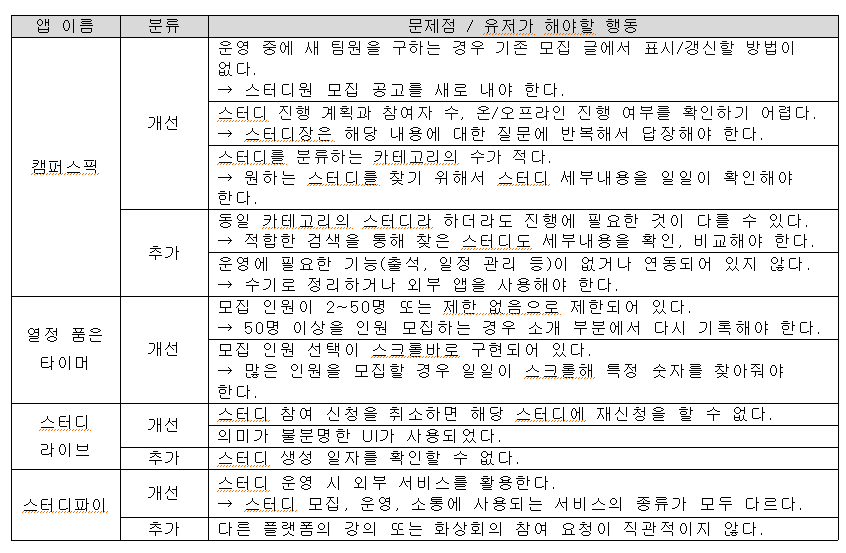
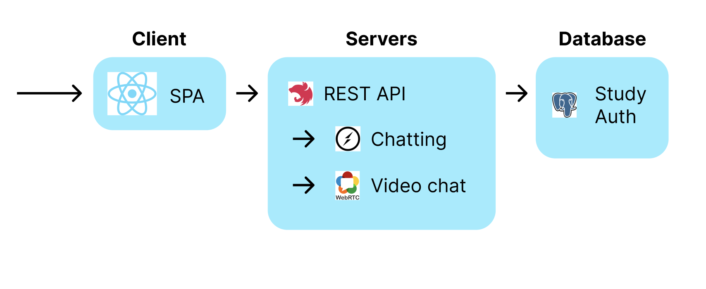

# 한밭대학교 컴퓨터공학과 Uneducated Coder 팀

## 온라인 학습 커뮤니티 운영과 관리를 위한 플랫폼 개발

**팀 구성**

- 20171588 엄진식
- 20171618 유성현
- 20182134 조영록

## <u>Uneducated Coder</u> Project Background

- ### 필요성

  - 기업이 공채를 줄이거나 폐지하고 수시 채용을 늘리는 상황에서 학생들이 대학 수업만으로는 기업에서 요구하는 다양한 경험, 예를 들면 협업 등을 경험하기 어렵고, 다른 대안이 필요하다.

  - 그 대안으로 학원이나 부트캠프가 있지만 비용, 시간 등의 문제로 쉽게 접근할 수 없지만 현직전문가들이 학생 등을 대상으로 스터디 그룹을 운영하는 경우가 많다.

  - 그러나 스터디 그룹 모집 및 관리가 분산되어 있거나 스터디 운영이 다른 외부 서비스를 통해서 지원하는 경우가 대다수이다. 즉, 현재 스터디 모집과 관리 모두를 지원하는 서비스는 없는 실정이다.

- ### 기존 해결책의 문제점
  

## System Design

- ### System Requirements

  - Single Page Application 방식의 웹 페이지를 호스팅하는 웹 서버
  - Study와 계정 검증, 인가하는 API 백 엔드 서버 + PostgreSQL 기반 데이터베이스
  - Socket.io 프레임워크를 이용한 채팅 서버
  - Socket.io 프레임워크와 webRTC API를 이용한 화상회의 시그널링 서버

- ### System Architecture

## Conclusion

- ### 스터디와 채팅

  - 스터디 모집 및 운영과 인증 기능 구현
  - 각 스터디 당 스터디원과 대화할 수 있는 채팅 기능 구현
    

- ### 화상회의

  - 화상회의를 중개하는 서버를 둘 경우 클라이언트의 부하를 서버쪽으로 가져올 수 있으나, 여건을 고려하여 클라이언트가 모든 부하를 가져오는 p2p 방식으로 구현했다.
  - 즉, 6명 이상이 화상회의를 하는 경우, 클라이언트에 부하가 심해져 정상적으로 할 수 없다.
    
